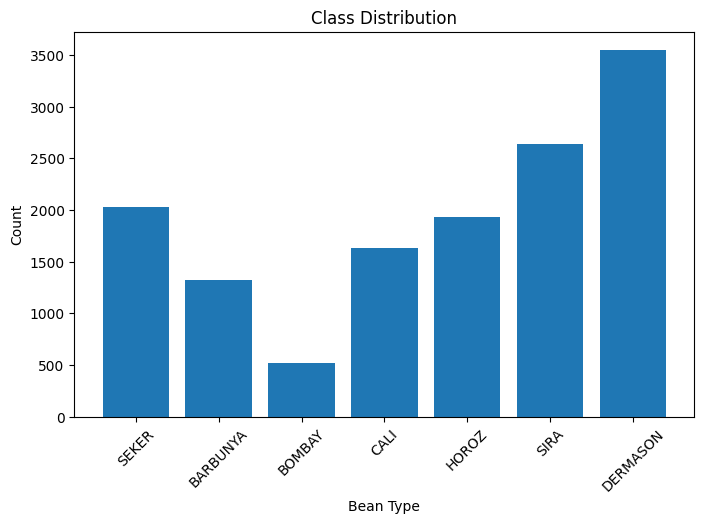
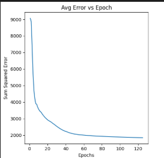
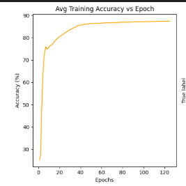
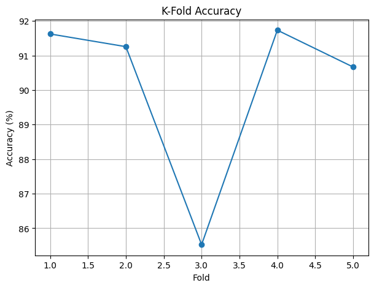
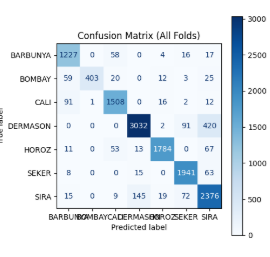
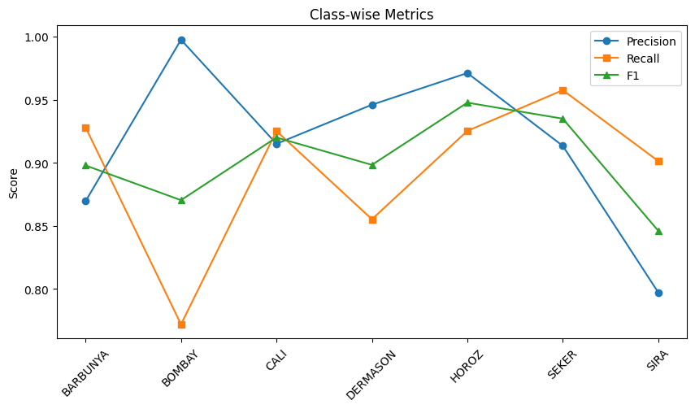

# 🌱 Dry Bean Classification Using Multi-Layer Perceptron (MLP) with 5-Fold Cross Validation

  <b>Automated Agricultural Classification using Artificial Neural Networks</b><br>
  Morphological Feature Analysis • Neural Networks • Cross Validation • Agricultural Intelligence
</p>

---

## 📌 Project Overview

Agricultural product classification plays a crucial role in quality control, food processing, inventory management, and export operations. Manual identification of bean varieties is often time-consuming and prone to human error, especially when dealing with large quantities of agricultural products.

This project develops a **custom Multi-Layer Perceptron (MLP) Neural Network from scratch** to classify different dry bean varieties using their morphological characteristics.

The model learns from geometric and shape-based measurements extracted from bean samples and uses **5-Fold Cross Validation** to ensure robust and reliable performance.

---

## 🎯 Problem Statement

Different bean varieties often share similar physical characteristics such as:

- Area
- Perimeter
- Shape
- Compactness
- Aspect Ratio

These similarities make manual classification challenging.

The objective of this project is to determine whether a custom neural network can accurately classify bean varieties using only their morphological measurements.

---

## 🌾 Dataset Information

### Dataset

**Dry Bean Dataset**

### Domain

Agriculture / Food Processing / Crop Quality Assessment

### Number of Samples

**13,611**

### Number of Classes

**7 Bean Varieties**

| Bean Variety |
|-------------|
| BARBUNYA |
| BOMBAY |
| CALI |
| DERMASON |
| HOROZ |
| SEKER |
| SIRA |

### Input Features

The dataset contains **16 morphological and geometric features**, including:

- Area
- Perimeter
- Major Axis Length
- Minor Axis Length
- Aspect Ratio
- Compactness
- Eccentricity
- Convex Area
- Equivalent Diameter
- Shape Factors

---

## 🔄 Project Workflow

```text
Dry Bean Dataset
        │
        ▼
Data Preprocessing
(Label Encoding + Normalization)
        │
        ▼
5-Fold Cross Validation
        │
        ▼
Custom MLP Neural Network
        │
        ▼
Model Training
        │
        ▼
Performance Evaluation
        │
        ▼
Agricultural Classification
```

---

## ⚙️ Data Preprocessing

### ✅ Label Encoding

Bean varieties were converted into numerical labels for neural network processing.

### ✅ Min-Max Normalization

All feature values were scaled between:

```text
0 → 1
```

### Benefits

✔ Faster Convergence

✔ Stable Gradient Updates

✔ Improved Learning Efficiency

✔ Reduced Feature Scale Bias

---

## 🧠 Neural Network Architecture

This project implements a **custom Multi-Layer Perceptron (MLP)** using feedforward propagation and backpropagation.

| Layer | Neurons |
|---------|---------:|
| Input Layer | 16 |
| Hidden Layer 1 | 64 |
| Hidden Layer 2 | 32 |
| Hidden Layer 3 | 16 |
| Output Layer | 7 |

### Activation Function

```text
Sigmoid
```

### Learning Algorithm

```text
Gradient Descent + Backpropagation
```

---

## ⚙️ Training Configuration

| Parameter | Value |
|------------|---------|
| Learning Rate | 0.05 |
| Epochs | 125 |
| Validation Method | 5-Fold Cross Validation |
| Loss Function | Sum of Squared Error (SSE) |
| Random Seed | 1 |

---

# 📊 Exploratory Data Analysis

## 🌾 Class Distribution

<p align="center">
  
</p>

### Insight

The dataset contains seven bean varieties with varying sample sizes.

**DERMASON** and **SIRA** are the most represented classes, while **BOMBAY** contains the fewest samples.

Despite moderate class imbalance, the dataset provides sufficient representation for effective neural network training.

---

# 📉 Training Performance Analysis

## Error Reduction During Training

<p align="center">
  
</p>

### Key Observation

Initial Error:

```text
≈ 9,100
```

Final Error:

```text
≈ 1,800
```

### Interpretation

The steep decline during the early epochs indicates rapid learning of dominant morphological patterns.

As training progresses, the network refines subtle distinctions among bean varieties, resulting in gradual convergence.

### Insight

✅ Successful Learning

✅ Stable Optimization

✅ Effective Backpropagation

---

## 📈 Training Accuracy Progression

<p align="center">
  
</p>

### Key Observation

Initial Accuracy:

```text
≈ 24%
```

Final Accuracy:

```text
≈ 87%
```

### Interpretation

The increasing accuracy demonstrates that the neural network continuously improves its understanding of bean morphology and develops stronger decision boundaries between classes.

### Insight

The model successfully transforms raw measurements into meaningful classification knowledge.

---

# 🔍 Cross Validation Performance

## K-Fold Accuracy

<p align="center">
  
</p>

### Fold-wise Accuracy

| Fold | Accuracy (%) |
|---------|---------:|
| Fold 1 | 91.6 |
| Fold 2 | 91.3 |
| Fold 3 | 85.5 |
| Fold 4 | 91.8 |
| Fold 5 | 90.7 |

### Average Accuracy

# ⭐ 90.18%

### Interpretation

The model maintains consistently strong performance across multiple folds.

This demonstrates:

- Good Generalization
- Low Variance
- Strong Stability
- Reliable Classification Capability

---

# 🎯 Confusion Matrix Analysis

<p align="center">
  
</p>

### Correctly Classified Samples

| Bean Variety | Correct Predictions |
|-------------|--------------------:|
| BARBUNYA | 1227 |
| BOMBAY | 403 |
| CALI | 1508 |
| DERMASON | 3032 |
| HOROZ | 1784 |
| SEKER | 1941 |
| SIRA | 2376 |

### Interpretation

The strong diagonal dominance indicates that the model accurately learns the unique morphological characteristics associated with each bean variety.

### Common Misclassifications

| Actual Class | Predicted Class |
|-------------|----------------|
| DERMASON | SIRA |
| SIRA | DERMASON |
| CALI | BARBUNYA |
| BARBUNYA | CALI |
| HOROZ | SIRA |

These classes share similar geometric properties, increasing classification complexity.

---

# 📈 Class-wise Performance Metrics

<p align="center">
  
</p>

### Performance Summary

| Class | Precision | Recall | F1 Score |
|---------|---------:|---------:|---------:|
| BARBUNYA | 0.87 | 0.93 | 0.90 |
| BOMBAY | 1.00 | 0.77 | 0.87 |
| CALI | 0.92 | 0.93 | 0.92 |
| DERMASON | 0.95 | 0.86 | 0.90 |
| HOROZ | 0.97 | 0.93 | 0.95 |
| SEKER | 0.91 | 0.96 | 0.94 |
| SIRA | 0.80 | 0.90 | 0.85 |

---

## 🏆 Best Performing Classes

### HOROZ

- Precision: 0.97
- Recall: 0.93
- F1 Score: 0.95

### SEKER

- Precision: 0.91
- Recall: 0.96
- F1 Score: 0.94

### CALI

- Precision: 0.92
- Recall: 0.93
- F1 Score: 0.92

### Why?

These classes possess distinctive morphological characteristics, making them easier to separate.

---

## ⚠ Most Challenging Classes

### SIRA

- Precision: 0.80
- Recall: 0.90
- F1 Score: 0.85

### BOMBAY

- Precision: 1.00
- Recall: 0.77
- F1 Score: 0.87

### Why?

These classes exhibit feature overlap with neighboring varieties, increasing classification difficulty.

---

# 📌 Key Findings

✅ Average Cross Validation Accuracy: **90.18%**

✅ Training Accuracy Reached: **87%**

✅ Strong Generalization Across Folds

✅ Effective Learning of Morphological Features

✅ Minimal Prediction Bias

✅ Robust Multiclass Classification Performance

---

# 🌍 Real-World Applications

### 🌾 Agricultural Automation

Automated bean sorting and grading systems.

### 🏭 Food Processing Industry

Bean classification before packaging and distribution.

### 📦 Export Quality Control

Automated quality verification and crop certification.

### 🚜 Smart Farming

AI-driven crop monitoring and agricultural decision support.

### 🔬 Agricultural Research

Morphological analysis and varietal identification.

---

# 💡 Key Insight

> Morphological measurements contain sufficient discriminatory information to accurately classify dry bean varieties. A custom neural network combined with K-Fold Cross Validation can achieve highly reliable agricultural classification performance without requiring image-based deep learning techniques.

---

# 🚀 Conclusion

This project demonstrates the successful implementation of a custom Multi-Layer Perceptron Neural Network for dry bean classification using morphological characteristics.

The model achieved an average cross-validation accuracy of **90.18%**, successfully distinguishing seven bean varieties while maintaining strong precision, recall, and F1 scores.

The results highlight the potential of machine learning for agricultural automation, crop quality assessment, and intelligent food processing systems.

---

## 👨‍💻 Author

**Mayur Shetty**

*M.Sc. Data Science & Artificial Intelligence*

Neural Networks • Machine Learning • Agricultural Analytics • Artificial Intelligence
